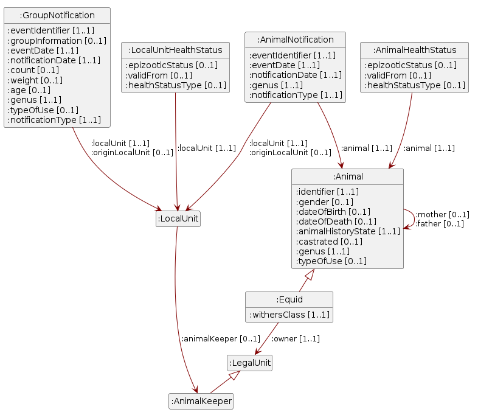

# Auxiliary document: animal movement data

October 2, 2026

- [Note](#sec-note)
- [1
  Introduction](#sec-introduction)
  - [1.1 Status](#sec-status)
  - [1.2 Field of
    application](#sec-scope-of-application)
  - [1.3 Animal movement
    reporting in Switzerland](#sec-animal-movement-reporting)
  - [1.4
    References](#sec-references)
- [2 Data
  Model](#sec-data-model)
  - [2.1 Animal
    keeper](#sec-nodeshape-animalkeepershape)
  - [2.2
    Equid](#sec-nodeshape-equidshape)
  - [2.3 Group
    notification](#sec-nodeshape-groupnotificationshape)
  - [2.4 Health status of a
    local unit](#sec-nodeshape-localunithealthstatusshape)
  - [2.5 Health status of an
    individual animal](#sec-nodeshape-animalhealthstatusshape)
  - [2.6 Individual
    animal](#sec-nodeshape-animalshape)
  - [2.7 Individual animal
    notification](#sec-nodeshape-animalnotificationshape)
  - [2.8 Legal
    unit](#sec-nodeshape-legalunitshape)
  - [2.9 Local
    unit](#sec-nodeshape-localunitshape)
- [3 Code
  lists](#sec-code-lists)
  - [3.1 Health status of an
    individual animal](#sec-codelist-animalhealthstatus)
  - [3.2 Animal history
    state](#sec-codelist-animalhistorystate)
  - [3.3 Type of use (cattle,
    sheep, goats)](#sec-codelist-animaltypeofuse)
  - [3.4 Type of use
    (equids)](#sec-codelist-equidtypeofusage)
  - [3.5 Withers
    class](#sec-codelist-equidwithersclass)
  - [3.6
    Gender](#sec-codelist-gender)
  - [3.7
    Genus](#sec-codelist-genus)
  - [3.8 Health status
    type](#sec-codelist-healthstatustype)
  - [3.9 Health status of a
    local unit](#sec-codelist-localunithealthstatus)
  - [3.10 Notification
    type](#sec-codelist-notificationtype)
- [4 Safety
  considerations](#sec-safety-consideration)
- [5
  Disclaimer](#sec-disclaimer)
- [6
  Copyrights](#sec-copyrights)
- [7 Annex A -
  References](#sec-appendix-a)
- [8 Annex B - Cooperation and
  Verification](#sec-appendix-b)
- [9 Annex C - Abbreviations and
  Glossary](#sec-appendix-c)
- [10 Annex D - Changes in
  comparison to previous version](#sec-appendix-d)
- [11 Annex E - Table of
  figures](#sec-appendix-e)
- [12 Annex F - Table of
  tables](#sec-appendix-f)

# Note

This document uses a gender-neutral formulation when referring to
persons. This is based on the guidelines (German) of the Federal
Chancellery. Depending on the situation, paired forms (citizens),
gender-abstract forms (insured person), gender-neutral forms (insured
person) or paraphrases with-out personal reference are used. The generic
masculine (citizen) is not permitted. Full forms are used in continuous
texts, i.e. in texts consisting of formulated sentences. Short forms can
be used in ab-breviated text passages, namely in tables. The short form
is used with a slash but without an ellipsis (referent). Gender
asterisks and similar spellings are not used.

# Introduction

## Status

In progress: Use is permitted only within the technical group and the
Experts’ Committee.

## Field of application

This document describes the data of the animal movement database (TVD)
semantically, so that specialists without in-depth IT knowledge can also
gain a better understanding of the data.

## Animal movement reporting in Switzerland

In the 1990s, Swiss agriculture and the food industry were severely
challenged by the animal disease BSE. When the realisation that the
disease could be transmitted from animals to humans was confirmed in
1996, this caused great uncertainty. Expectations regarding the safety
of food of animal origin rose as a result, as did awareness of the
importance of food control. The approach «from stable to table» became
established. Risk-based surveillance, seamless traceability of farm
animals, control of animal movements, the obligation to declare origin
and quality controls throughout the production and processing chain have
formed the basis for a high standard of food safety ever since.

The BSE experience led to the establishment of a national animal
movement database (TVD) in 1999. Article 7a and Articles 13–15 of the
Animal Diseases Act and Title 2, Sections 1, 1a and 2a of the Animal
Diseases Ordinance set out the basic legal provisions on the
identification/marking and the registration of farm animals as well as
the associated reporting obligations. They follow European legislation
on the same subject (Regulation (EU) 2016/429 on transmissible animal
diseases; Delegated Regulation (EU) 2019/2035 on establishments keeping
terrestrial animals and hatcheries, and on traceability).

While only cattle were subject to reporting from 1999, pigs and equids
followed from 2011, although pigs are to this day not reported as
individual animals. From 2014 and 2020 respectively, the obligation to
report to the TVD also applied to small ruminants (sheep and goats). At
the beginning, in 2014, this concerned only the slaughterhouses. Since
2014 there has also been an obligation to report poultry. Since January
2020, keepers of small ruminants have been included in individual animal
reporting as well. The identification and marking of cloven-hoofed
animals with ear tags, the individual registration of cattle, sheep and
goats in the TVD, and the reporting of animal arrivals, animal
departures (an animal leaves a holding alive), births, imports, exports,
slaughter, on-farm slaughter and death (an animal is deregistered as no
longer living) are mandatory for all animal keepers in Switzerland.

The TVD is part of a system landscape spanning agriculture, veterinary
affairs and food safety. The central entry point is the Agate portal,
with the agricultural policy information system AGIS at its centre.

<!-- Abbildung «Systemlandschaft und Datenflüsse» wird nachgeliefert. -->

The Ordinance on Identitas AG and the animal movement database (IdTVD-V)
further sets out the content relating to animal movements, the tasks of
Identitas AG and the rights of access to the data. The importance of
identifying/marking farm animals goes far beyond the subject of animal
disease and therefore also found its way into agricultural legislation
(Agriculture Act LwG, Articles 165g, 177 and 185) and various associated
ordinances. The animal movement data have become an indispensable
component in implementing agricultural policy measures, for example
animal-related direct payments, the determination of nutrient flows or
agri-environmental monitoring. The data also serve as a basis for the
structural survey of Swiss agriculture and for agricultural statistics
in general.

Animal movement reporting quickly became established along the entire
food value chain as well. Programmes with animal welfare, traceability
and origin commitments rely on it. The variety of animal information
from animal movement reporting is also reflected in the publicly
available datasets of the Tierstatistik open data platform.

The technical interface description in this document is based on the
technical service description AnimalTracing v1.32 and on the openAPI
specification v. x.xx.

## References

Interfaces: AnimalTracing API, technical service description
AnimalTracing

NB: the names of the classes described in chapter 3 do not match the
ServiceOperations in AnimalTracing, because the semantic description is
intended to provide an overview of the data content and is more detailed
than the service description.

# Data Model

Figure 1: UML diagram of the eCH-0309 data model.

## Animal keeper

A farm manager (Bewirtschafter) is a legal unit as defined in eCH-0108
that bears the business risk for a farm (LBV Art. 2). The animal keeper
is a form of farm manager that keeps animals (LBV Art. 11a) and
therefore requires a local unit (animal holding). Responsibility for
reporting lies with the animal keeper for all animal categories except
equids; for equids it lies with the owner (chapter 3.1.1 of the tool).
The attributes are described in
[eCH-0261](https://ech.ch/sites/default/files/imce/eCH-Dossier/eCH-Dossier_PDF_Publikationen/Hauptdokument/STAN_d_DEF_2024-02_07_eCH-0261_V1.0.0_Datenstandard_Agrardaten_Stammdaten.pdf),
chapters 3.1 and 3.2.

**Target Class:** `:AnimalKeeper`

## Equid

Subclass of the class individual animal for animals of the equid genus
(horse, mule, hinny, donkey). All attributes of the class individual
animal also apply to equids; this class describes only the additional,
equid-specific information. For equids, responsibility for reporting
lies with the owner rather than with the animal keeper. An owner is the
legal unit that owns equids; the term is used for equid owners only
(chapter 3.1.1 of the tool).

**Target Class:** `:Equid`

Table 1: properties Equid

| Description | Path | Type | Card. |
|:---|:---|:---|---:|
| **Owner**: The legal unit that owns the equid. For equids, responsibility for reporting lies with the owner rather than with the animal keeper (chapter 3.1.1 of the tool). | `:owner` | [`:LegalUnit`](#sec-nodeshape-legalunitshape) | 1..1 |
| **Withers class** | `:withersClass` | `:EquidWithersClass` | 1..1 |

## Group notification

An event concerning a group of animals that cannot be identified
individually. Group notifications are recorded for animals of the
categories pigs and poultry; the individuals of such a group are
therefore not known. Events are reported by the natural persons of the
responsible legal unit, the animal keeper. They comprise housing
notifications for poultry, movement notifications for pigs, and
slaughter notifications for pigs (by head) and poultry groups (in kg).
This class has no counterpart in the AnimalTracing openAPI
specification, because pigs and poultry are not covered there.

**Target Class:** `:GroupNotification`

Table 2: properties Group notification

| Description | Path | Type | Card. |
|:---|:---|:---|---:|
| **Local unit**: BUR number of the local unit | `:localUnit` | [`:LocalUnit`](#sec-nodeshape-localunitshape) | 1..1 |
| **Origin**: BUR number of the local unit the animal comes from | `:originLocalUnit` | [`:LocalUnit`](#sec-nodeshape-localunitshape) | 0..1 |
| **ID**: Unique identifier of the movement, assigned by the system. | `:eventIdentifier` | `xsd:string` | 1..1 |
| **Genus** | `:genus` | `:Genus` | 1..1 |
| **Group information**: Group information must be given for housing notifications of poultry | `:groupInformation` | `xsd:string` | 0..1 |
| **Notification type** | `:notificationType` | `:NotificationType` | 1..1 |
| **Event date**: Date on which the event took place | `:eventDate` | `xsd:date` | 1..1 |
| **Notification date**: Date on which the event was reported | `:notificationDate` | `xsd:date` | 1..1 |
| **Number**: Number of animals moved in one movement (pigs/poultry) | `:count` | `xsd:integer` | 0..1 |
| **Weight**: Total weight in kg of the animal group for slaughter notifications of poultry | `:weight` | `xsd:integer` | 0..1 |
| **Type of use**: Type of use of the animal group (for individual animals it is held on the class «Einzeltier») | `:typeOfUse` | `:AnimalTypeOfUse` | 0..1 |
| **Age**: For housing notifications of poultry the age must be given in weeks | `:age` | `xsd:integer` | 0..1 |

## Health status of a local unit

Where animal disease events are of national significance, it is
essential that animal keepers are informed about movement bans and
disease status, so that the risk of spread through animal movements can
be minimised. Disease information recorded for a local unit. In addition
to the epizootic status of a local unit, vaccination, risk and
laboratory results can also be represented. The AnimalTracing openAPI
specification has no dedicated class for this; there the corresponding
information is held as attributes of the local unit.

**Target Class:** `:LocalUnitHealthStatus`

Table 3: properties Health status of a local unit

| Description | Path | Type | Card. |
|:---|:---|:---|---:|
| **Local unit**: BUR number of the local unit | `:localUnit` | [`:LocalUnit`](#sec-nodeshape-localunitshape) | 1..1 |
| **Type**: e.g. epizootic, vaccination or risk status | `:healthStatusType` | `:HealthStatusType` | 0..1 |
| **Status** | `:epizooticStatus` | `:LocalUnitEpizooticStatus` | 0..1 |
| **Date**: Date from which the status is valid | `:validFrom` | `xsd:date` | 0..1 |

## Health status of an individual animal

Disease information recorded for an individual animal. In addition to
the individual epizootic status, relevant vaccinations are recorded as
well.

**Target Class:** `:AnimalHealthStatus`

Table 4: properties Health status of an individual animal

| Description | Path | Type | Card. |
|:---|:---|:---|---:|
| **Animal ID**: A health status of an individual animal refers to exactly one individual animal. | `:animal` | [`:Animal`](#sec-nodeshape-animalshape) | 1..1 |
| **Type**: e.g. epizootic, vaccination or risk status | `:healthStatusType` | `:HealthStatusType` | 0..1 |
| **Status** | `:epizooticStatus` | `:AnimalEpizooticStatus` | 0..1 |
| **Date**: Date from which the status is valid, or the date of vaccination | `:validFrom` | `xsd:date` | 0..1 |

## Individual animal

An individually identified farm animal. In the animal movement database,
animals of the categories cattle, sheep, goats and equids are recorded
as individual animals; they are uniquely identified by their ear tag
number, or by the UELN in the case of equids. No individual animals are
kept for pigs and poultry, only group notifications.

**Target Class:** `:Animal`

Table 5: properties Individual animal

| Description | Path | Type | Card. |
|:---|:---|:---|---:|
| **Mother**: An individual animal has at most one mother animal. | `:mother` | [`:Animal`](#sec-nodeshape-animalshape) | 0..1 |
| **Father**: An individual animal has at most one father animal. | `:father` | [`:Animal`](#sec-nodeshape-animalshape) | 0..1 |
| **Identifier**: Ear tag number, or UELN for equids | `:identifier` | `xsd:string` | 1..1 |
| **Genus** | `:genus` | `:Genus` | 1..1 |
| **Gender** | `:gender` | `:Gender` | 0..1 |
| **Date of birth** | `:dateOfBirth` | `xsd:date` | 0..1 |
| **Date of death** | `:dateOfDeath` | `xsd:date` | 0..1 |
| **Animal history state** | `:animalHistoryState` | `:AnimalHistoryState` | 1..1 |
| **Type of use** | `:typeOfUse` | `:AnimalTypeOfUse` | 0..1 |
| **Castrated** | `:castrated` | `xsd:boolean` | 0..1 |

## Individual animal notification

An event concerning an individual animal. Events comprise movement
notifications, notifications of basic data, changes to individual
attributes of the basic data as well as final notifications. A
notification always refers to the local unit at which the event took
place and may in addition state the local unit of origin. Events are
reported by the authorised persons, stating the animal holding to which
the notification refers; for equids they are reported by the authorised
persons of the responsible equid owner.

**Target Class:** `:AnimalNotification`

Table 6: properties Individual animal notification

| Description | Path | Type | Card. |
|:---|:---|:---|---:|
| **Identifier**: An individual animal notification refers to exactly one individual animal. | `:animal` | [`:Animal`](#sec-nodeshape-animalshape) | 1..1 |
| **Local unit**: BUR number of the local unit to which the notification refers | `:localUnit` | [`:LocalUnit`](#sec-nodeshape-localunitshape) | 1..1 |
| **Origin**: BUR number of the local unit the animal comes from | `:originLocalUnit` | [`:LocalUnit`](#sec-nodeshape-localunitshape) | 0..1 |
| **ID**: Unique identifier of the movement, assigned by the system. | `:eventIdentifier` | `xsd:string` | 1..1 |
| **Genus** | `:genus` | `:Genus` | 1..1 |
| **Notification type** | `:notificationType` | `:NotificationType` | 1..1 |
| **Event date**: Date on which the event took place | `:eventDate` | `xsd:date` | 1..1 |
| **Notification date**: Date on which the event was reported | `:notificationDate` | `xsd:date` | 1..1 |

## Legal unit

A legal unit as defined in eCH-0108 is a legal entity (e.g. a public
limited company or a limited liability company), a partnership (e.g. a
general partnership) or a self-employed natural person that is subject
to the federal act on the business identification number (UIDG) and has
an entry in the UID register. It identifies, for example, the taxable
entity for the tax authorities or the person liable for social insurance
contributions. The legal unit is identified by its UID. Only where the
enterprise is a «sole proprietorship» is the farm manager at the same
time a natural person. The master system for this data is the FSO’s UID
register; the agricultural information system obtains the data from that
register through an interface. The animal keeper and the equid owner are
the two forms of legal unit that occur in this Hilfsmittel (chapter
3.1.1 of the tool). The attributes are described in
[eCH-0261](https://ech.ch/sites/default/files/imce/eCH-Dossier/eCH-Dossier_PDF_Publikationen/Hauptdokument/STAN_d_DEF_2024-02_07_eCH-0261_V1.0.0_Datenstandard_Agrardaten_Stammdaten.pdf),
chapters 3.1 and 3.2, and in
[eCH-0108](https://ech.ch/sites/default/files/imce/eCH-Dossier/eCH-Dossier_PDF_Publikationen/Hauptdokument/STAN_d_DEF_2023-12-21_eCH-0108_V6.0.0_Unternehmensstammdaten%20Unternehmensregister.pdf),
chapter 3.1.

**Target Class:** `:LegalUnit`

## Local unit

A local unit as defined in eCH-0108 is a facility at a given location
where an economic activity is carried out. A local unit has a BUR number
and is always assigned to a legal unit (or enterprise). The local unit
is identified by its BUR number. A local unit may consist of one or more
buildings. The EGID assigned to the BUR number refers to «the centre» of
the local unit, that is, its main building. In the TVD, local units are
called «animal holdings» and are additionally identified by their TVD
number. This definition is taken from
[eCH-0108](https://ech.ch/sites/default/files/imce/eCH-Dossier/eCH-Dossier_PDF_Publikationen/Hauptdokument/STAN_d_DEF_2023-12-21_eCH-0108_V6.0.0_Unternehmensstammdaten%20Unternehmensregister.pdf),
chapter 1.5; the agriculture-specific additions are described in
[eCH-0261](https://ech.ch/sites/default/files/imce/eCH-Dossier/eCH-Dossier_PDF_Publikationen/Hauptdokument/STAN_d_DEF_2024-02_07_eCH-0261_V1.0.0_Datenstandard_Agrardaten_Stammdaten.pdf),
chapters 3.3 and 3.4.

**Target Class:** `:LocalUnit`

Table 7: properties Local unit

| Description | Path | Type | Card. |
|:---|:---|:---|---:|
| **Animal keeper**: Assignment of the local unit to the animal keeper. According to eCH-0108, chapter 1.5, a local unit is always assigned to a legal unit (or enterprise); the master data of the local unit carries the optional attribute «mainUid» holding the UID of the main legal unit. Because the object catalogue treats the animal keeper only as a special form of the legal unit, this assignment is not mandatory. | `:animalKeeper` | [`:AnimalKeeper`](#sec-nodeshape-animalkeepershape) | 0..1 |

# Code lists

For some of these code lists no French or Italian designations are
available yet; the designations below are given in German and English,
as provided by the sources.
(<https://test-03-tvd-api-at.identitas.ch/open-api/v1.0>, 2026-09-24)

## Health status of an individual animal

Table 8: Values of the code list Health status of an individual animal

| Value        | Designation | Description              |
|:-------------|:------------|:-------------------------|
| `Blocked`    | Blocked     | Type: epizootic status   |
| `Free`       | Free        | Type: epizootic status   |
| `NotTested`  | Not tested  | Type: epizootic status   |
| `Vaccinated` | Vaccinated  | Type: vaccination status |

## Animal history state

Table 9: Values of the code list Animal history state

| Value         | Designation  | Description |
|:--------------|:-------------|:------------|
| `Lost`        | Lost         |             |
| `NotDefined`  | Not defined  |             |
| `NotOk`       | Not ok       |             |
| `Ok`          | Ok           |             |
| `TemporaryOk` | Temporary ok |             |

## Type of use (cattle, sheep, goats)

Table 10: Values of the code list Type of use (cattle, sheep, goats)

| Value   | Designation | Description                    |
|:--------|:------------|:-------------------------------|
| `Milk`  | Milk        | Milchkühe, -schafe und -ziegen |
| `Other` | Other       |                                |

## Type of use (equids)

Table 11: Values of the code list Type of use (equids)

| Value             | Designation      | Description |
|:------------------|:-----------------|:------------|
| `CompanionAnimal` | Companion animal |             |
| `FarmAnimal`      | Farm animal      |             |

## Withers class

Table 12: Values of the code list Withers class

| Value                  | Designation                 | Description |
|:-----------------------|:----------------------------|:------------|
| `GreaterThan148cm`     | Withers height above 148 cm |             |
| `LessOrEqualThan148cm` | Withers height up to 148 cm |             |

## Gender

Table 13: Values of the code list Gender

| Value    | Designation | Description |
|:---------|:------------|:------------|
| `Female` | Female      |             |
| `Male`   | Male        |             |

## Genus

Table 14: Values of the code list Genus

| Value | Designation | Description |
|:---|:---|:---|
| `Camelid` | Camelid | Neuweltkameliden |
| `Cattle` | Cattle | Tiere der Rindergattung (Bos) und Wasserbüffel (Bubalus bubalis) |
| `Equid` | Equid | Tiere der Pferdegattung (Pferd, Maultier, Maulesel, Esel) |
| `Game` | Game | Wild in Gehegen |
| `Goat` | Goat |  |
| `Pig` | Pig |  |
| `Poultry` | Poultry |  |
| `Sheep` | Sheep |  |

## Health status type

Table 15: Values of the code list Health status type

| Value               | Designation        | Description |
|:--------------------|:-------------------|:------------|
| `EpizooticStatus`   | Epizootic status   |             |
| `LaboratoryResult`  | Laboratory result  |             |
| `RiskStatus`        | Risk status        |             |
| `VaccinationStatus` | Vaccination status |             |

## Health status of a local unit

Table 16: Values of the code list Health status of a local unit

| Value       | Designation | Description             |
|:------------|:------------|:------------------------|
| `Blocked`   | Blocked     | Type: epizootic status  |
| `Free`      | Free        | Type: epizootic status  |
| `High`      | High        | Type: risk status       |
| `Low`       | Low         | Type: risk status       |
| `Medium`    | Medium      | Type: risk status       |
| `Negative`  | Negative    | Type: laboratory result |
| `NotTested` | Not tested  | Type: epizootic status  |
| `Positive`  | Positive    | Type: laboratory result |

## Notification type

Table 17: Values of the code list Notification type

| Value | Designation | Description |
|:---|:---|:---|
| `Arrival` | Arrival | Not for equids |
| `Birth` | Birth |  |
| `DayStay` | Day stay | Not for equids |
| `DeathBirth` | Stillbirth | Not for equids |
| `Deceased` | Death | For equids: euthanasia |
| `Export` | Export | For equids: transfer of ownership abroad |
| `FirstRegistration` | First registration |  |
| `Import` | Import |  |
| `ImportAfterExport` | Import after export | Not for equids |
| `Leaving` | Departure | Not for equids |
| `LocationChange` | Change of location | For equids only |
| `OnFarmSlaughter` | On-farm slaughter | Not for equids |
| `Slaughter` | Slaughter |  |

# Safety considerations

Information about the explicitly relevant legal bases or a note that
during the implementation the rele-vant legal bases must be observed.

# Disclaimer

eCH-standards which the registered association eCH provides the user
free of charge or which make reference to eCH shall only have the status
of recommendations. The registered association eCH will not be liable in
any event for any decisions made or measures taken by the user based on
these documents. The user will be responsible for verifying the
documents himself prior to their use and to seek advice if required.
eCH-standards can and shall not replace the technical, organizational or
legal advice in the individual case.

Documents, procedures, methods, products and standards that are made
reference to in eCH-standards are possibly protected by trademarks,
copyrights or patents. It is the exclusive responsibil-ity of the user
to obtain the necessary licences from the entitled persons and/or
organizations.

Although the registered association eCH has taken adequate care to
prepare the eCH-standards with due diligence, it cannot grant any
warranty or guarantee that the information and documents provided are
up-to-date, complete, true or without any errors. eCH reserves the right
to change the contents of the eCH-standards at any time and without
prior announcement.

Any liability for damage caused by the use of the eCH-standards by the
user shall be excluded to the extent legally admissible.

# Copyrights

Persons preparing eCH-standards shall remain the owners of their
intellectual property rights. These persons, however, obligate
themselves to provide their intellectual property rights or other rights
in third party intellectual property rights, to the extent possible, to
the relevant technical units and the registered association eCH for free
and for unlimited use and further development as part of the purpose of
the association.

The standards prepared by the technical units can be used, distributed
and developed further for free and to an unlimited extent by stating the
name of the respective author of eCH.

eCH-standards are fully documented and free of any restrictions of
licence and/or patent law. The associated documentation can be requested
for free. These provisions shall apply to the standards prepared by eCH
only, however, not to any standards or products of third parties which
include reference to eCH-standards. The standards include the relevant
references to third party rights.

# Annex A - References

# Annex B - Cooperation and Verification

# Annex C - Abbreviations and Glossary

Table 18: Glossary of eCH-0309

<table>
<colgroup>
<col style="width: 20%" />
<col style="width: 25%" />
<col style="width: 55%" />
</colgroup>
<thead>
<tr>
<th style="text-align: left;">IRI</th>
<th style="text-align: left;">Term</th>
<th style="text-align: left;">Description</th>
</tr>
</thead>
<tbody>
<tr>
<td style="text-align: left;"><a
href="https://agriculture.ld.admin.ch/eCH-0309/1/term/animalHolding"><code>term:animalHolding</code></a></td>
<td style="text-align: left;"><strong>Animal holding</strong></td>
<td style="text-align: left;">In the animal movement database, local
units are called «animal holdings»; they are additionally identified by
their TVD number.</td>
</tr>
<tr>
<td style="text-align: left;"><a
href="https://agriculture.ld.admin.ch/eCH-0309/1/term/farmManager"><code>term:farmManager</code></a></td>
<td style="text-align: left;"><strong>Farm manager</strong></td>
<td style="text-align: left;">A legal unit that bears the business risk
for a farm (LBV Art. 2). The animal keeper is a form of farm manager
that keeps animals (LBV Art. 11a).</td>
</tr>
<tr>
<td style="text-align: left;"><a
href="https://agriculture.ld.admin.ch/eCH-0309/1/term/homeHolding"><code>term:homeHolding</code></a></td>
<td style="text-align: left;"><strong>Home holding</strong></td>
<td style="text-align: left;">For cattle, a home holding can be recorded
in order to represent an animal’s affiliation to an animal holding while
the animal is located on another local unit.</td>
</tr>
<tr>
<td style="text-align: left;"><a
href="https://agriculture.ld.admin.ch/eCH-0309/1/term/lindas"><code>term:lindas</code></a></td>
<td style="text-align: left;"><strong>Linked Data Service</strong>
(LINDAS)</td>
<td style="text-align: left;">The official Linked Data service of the
Swiss Federal Administration, acting as a triple store.</td>
</tr>
<tr>
<td style="text-align: left;"><a
href="https://agriculture.ld.admin.ch/eCH-0309/1/term/rdf"><code>term:rdf</code></a></td>
<td style="text-align: left;"><strong>Resource Description
Framework</strong> (RDF)</td>
<td style="text-align: left;">A central standard of the World Wide Web
Consortium (W3C) for modeling data structures on the Web. Information is
represented as networked graphs rather than in traditional tables.</td>
</tr>
<tr>
<td style="text-align: left;"><a
href="https://agriculture.ld.admin.ch/eCH-0309/1/term/reportingPerson"><code>term:reportingPerson</code></a></td>
<td style="text-align: left;"><strong>Reporting person</strong></td>
<td style="text-align: left;">The person or persons who make
notifications for an animal holding or for an equid owner.</td>
</tr>
<tr>
<td style="text-align: left;"><a
href="https://agriculture.ld.admin.ch/eCH-0309/1/term/triple"><code>term:triple</code></a></td>
<td style="text-align: left;"><strong>Triple</strong></td>
<td style="text-align: left;">
The basic structure of a statement in
RDF, consisting of a subject, predicate, and object.

<em>broader</em>: <a
href="https://agriculture.ld.admin.ch/eCH-0309/1/term/rdf"><code>term:rdf</code></a>
</td>
</tr>
</tbody>
</table>

# Annex D - Changes in comparison to previous version

# Annex E - Table of figures

# Annex F - Table of tables
